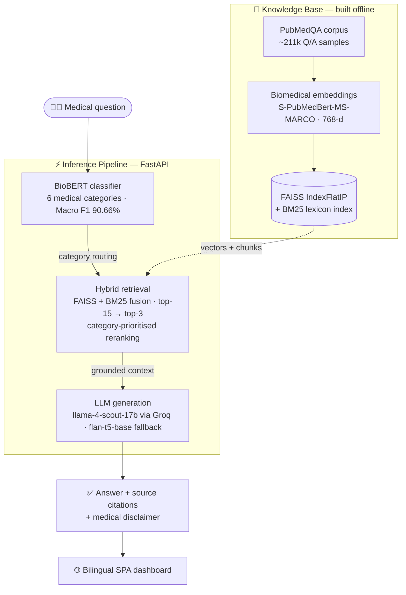

# 🏥 Healthcare RAG-Powered Medical Q&A Assistant

**eyouth × DEPI | Microsoft Machine Learning Track | 2026**

A production-grade Retrieval-Augmented Generation (RAG) system that answers medical
questions from a 211k-sample PubMedQA corpus: BioBERT classifies each query into one of
six medical categories, a FAISS + BM25 hybrid retriever grounds the context, and a
Groq-hosted LLM generates the answer — served by FastAPI with a bilingual web dashboard.

[](https://github.com/AbdelrahmanMatrix/Healthcare-RAG-Powered-Medical-QA-Assistant/actions/workflows/ci.yml)


## 🏆 Results at a Glance

Final evaluation run — full numbers in [`reports/evaluation_report.md`](reports/evaluation_report.md):

| KPI | Target | Result | Status |
|-----|--------|--------|--------|
| Classification Macro F1 (BioBERT) | ≥ 78% | **90.66%** | ✅ Pass |
| BERTScore F1 — primary answer quality | ≥ 0.80 | **0.8061** | ✅ Pass |
| ROUGE-L (abstractive) | ≥ 0.15 | **0.1911** | ✅ Pass |
| Faithfulness | ≥ 70% | **86.0%** | ✅ Pass |
| Hallucination rate | ≤ 15% | **10.0%** | ✅ Pass |

## ✨ Highlights

- **Hybrid retrieval** — FAISS `IndexFlatIP` dense search fused with BM25; top-15 candidates reranked to top-3 with category-prioritised boosting
- **Domain-tuned routing** — BioBERT (`dmis-lab/biobert-v1.1`) fine-tuned on 6 medical categories
- **Biomedical embeddings** — `S-PubMedBert-MS-MARCO` (768-d), pre-trained on PubMed/PMC
- **LLM inference** — `llama-4-scout-17b` via Groq API, with a local `flan-t5-base` fallback
- **Full-stack delivery** — FastAPI + nginx-served SPA dashboard, three-service Docker Compose stack, CI/CD to Azure App Services
- **MLOps** — MLflow experiment tracking, response caching, `/warmup` preloading
- **Bilingual UI** — English / العربية dashboard with live KPI board
- **Tested** — 469 tests across 16 suites gating a 95% coverage floor in CI, plus a Docker image smoke build

---

## 🚀 Quick Start (3 Commands)

```bash
# 1. Clone
git clone https://github.com/AbdelrahmanMatrix/Healthcare-RAG-Powered-Medical-QA-Assistant.git
cd Healthcare-RAG-Powered-Medical-QA-Assistant

# 2. Install
pip install -r requirements.txt
pip install -e .   # registers src/ as a package so absolute imports resolve

# 3. Download data + models (30 seconds)
python download.py
```

That's it. Run any notebook now.

<details>
<summary><strong>Expected output of <code>python download.py</code></strong></summary>

```
============================================================
🏥 Healthcare RAG — Data Setup
============================================================

✅ Downloaded: data/raw/pubmedqa_raw.csv (15.2 MB)
✅ Downloaded: data/processed/pubmedqa_cleaned.csv (12.1 MB)
✅ Downloaded: data/processed/pubmedqa_labelled.csv (12.3 MB)
✅ Downloaded: data/embeddings/faiss_index/pubmedqa_index_flatip.faiss (14.7 MB)
✅ Downloaded: data/embeddings/faiss_index/chunk_mapping.pkl (11.8 MB)
✅ Downloaded: data/processed/eval_holdout.csv (3.3 MB)

🎉 Setup complete! You can now run any notebook.
```

The BioBERT classifier auto-downloads from HuggingFace on first inference.
Open any notebook (e.g. `notebooks/10_end_to_end_test.ipynb`) and run all cells.

</details>

---

## 📁 Project Structure

```
├── notebooks/
│   ├── 01_data_loading.ipynb            # Load raw PubMedQA data
│   ├── 02_preprocessing.ipynb           # Clean & normalise text
│   ├── 03_category_labelling.ipynb      # Assign 6 medical categories
│   ├── 04_eda.ipynb                     # Exploratory data analysis
│   ├── 05_embeddings_vectorstore.ipynb  # Build FAISS vector index
│   ├── 06_rag_pipeline.ipynb            # RAG pipeline (Groq LLM)
│   ├── 07_classification_model.ipynb    # Fine-tune BioBERT classifier
│   ├── 08_evaluation.ipynb              # BLEU, ROUGE-L, hallucination
│   ├── 09_integrated_pipeline.ipynb     # Classifier + RAG integration
│   └── 10_end_to_end_test.ipynb         # Full pipeline verification
│
├── src/
│   ├── data/
│   │   ├── preprocessor.py              # Text cleaning pipeline
│   │   ├── labeller.py                  # Medical category labelling
│   │   ├── loader.py                    # Data loading utilities
│   │   └── hub.py                       # HuggingFace data sync
│   ├── rag/
│   │   ├── pipeline.py                  # RAG pipeline (FAISS + Groq LLM)
│   │   ├── embeddings.py                # Embedding utilities
│   │   ├── vectorstore.py               # FAISS index utilities
│   │   └── bm25_retriever.py            # BM25 hybrid retrieval
│   ├── classification/
│   │   └── classifier.py                # BioBERT classifier
│   ├── evaluation/
│   │   └── metrics.py                   # BLEU, ROUGE-L metrics
│   └── pipeline.py                      # Top-level entry point
│
├── api/                                 # FastAPI REST API
├── dashboard/                           # HTML SPA dashboard (bilingual)
├── docker/                              # Docker deployment
├── mlops/                               # MLflow tracking
├── reports/                             # Generated reports & figures
├── models/                              # Saved model weights
├── data/                                # Raw, processed, embeddings
├── config/                              # Settings
├── tests/                               # Unit tests
│
├── download.py                     # ← Run this after cloning
├── requirements.txt
├── setup.py
└── README.md
```

---

## 🏗️ Architecture



*The knowledge base (top) is built once by notebooks 01–05 and served from HuggingFace Hub;
the inference pipeline (bottom) is what the FastAPI service runs on every query.*

---

## 📊 Dataset

| Item | Value |
|------|-------|
| Source | [qiaojin/PubMedQA](https://huggingface.co/datasets/qiaojin/PubMedQA) |
| Rows | ~211,000 (pqa_artificial subset)
| Columns | question, context, answer, category |
| Categories | Symptoms, Diagnosis, Treatment, Medication, Prevention, General |

---

## 🧠 Models

### BioBERT Classifier
| Item | Value |
|------|-------|
| Base | `dmis-lab/biobert-v1.1` |
| Classes | 6 medical categories |
| HuggingFace | [AbdoMatrix/biobert-medical-classifier](https://huggingface.co/AbdoMatrix/biobert-medical-classifier) |

### Model Weights & Storage
| Item | Value |
|------|-------|
| Classifier weights | Auto-downloaded from [HuggingFace Hub](https://huggingface.co/AbdoMatrix/biobert-medical-classifier) on first inference — not stored in the repo |
| FAISS index + chunk mappings | Downloaded by `download.py` (or the API lifespan) from the project's HF dataset repo |
| Rationale | Keeps the repository lightweight; `models/` and `data/` hold only directory placeholders |

### RAG Pipeline
| Item | Value |
|------|-------|
| Embeddings | `pritamdeka/S-PubMedBert-MS-MARCO` (768d) |
| Vector Store | FAISS IndexFlatIP + BM25 hybrid retrieval |
| Generator | `meta-llama/llama-4-scout-17b-16e-instruct` via Groq API (falls back to `google/flan-t5-base` locally) |
| Retrieval | Top-15 candidates → reranked top-3 with category routing |
| HTTP Client | `openai` Python SDK pointed at `api.groq.com/openai/v1` |

---

## 📋 Notebook Run Order

Run in this order to reproduce everything from scratch:

```
01 → 02 → 03 → 04 → 05 → 06 → 07 → 08 → 09 → 10
```

Or skip to notebook 10 directly (auto-downloads data):

```bash
# Just run the verification notebook
jupyter notebook notebooks/10_end_to_end_test.ipynb
```

---

## 🧪 Testing

```bash
pytest                      # full suite
pytest tests/test_api.py    # single suite
make docker-test            # run inside a disposable container
```

| Suite | Focus |
|-------|-------|
| `test_rag_pipeline_unit.py` | Retrieval, reranking, answer cleaning (106 tests) |
| `test_workflow_yml.py` | Deploy-workflow structure assertions |
| `test_rag_modules.py` / `test_data_modules.py` | Embeddings, vector store, BM25, Hub client |
| `test_api.py` + `test_lifespan.py` | Endpoint behavior, startup/shutdown |
| `test_classifier_unit.py` | Category prediction and fallback paths |
| `test_metrics.py` | BLEU, ROUGE-L, BERTScore, faithfulness |
| `test_integration_full_pipeline.py` | End-to-end query flow |

CI enforces **flake8**, a **95% coverage floor**, and a **Docker build smoke test** on every push.

---

## 🔌 API (FastAPI)

```bash
uvicorn api.main:app --reload --host 0.0.0.0 --port 8000
```

### Endpoints

| Method | Endpoint | Description |
|--------|----------|-------------|
| POST | `/query` | Submit a medical question |
| GET | `/health` | Health check (model loaded, classifier ready, Groq configured) |
| GET | `/warmup` | Pre-load the RAG pipeline and classifier before traffic |
| GET | `/docs` | Swagger UI (interactive API docs) |
| GET | `/` | Root info (project, docs link, version) |

### Example

```bash
curl -X POST http://localhost:8000/query \
  -H "Content-Type: application/json" \
  -d '{"question": "What are the symptoms of diabetes?"}'
```

Response:
```json
{
  "answer": "...",
  "category": "Symptoms",
  "retrieved_sources": ["chunk_12345", "chunk_67890"],
  "source_citations": [
    {
      "chunk_id": 12345,
      "question": "...",
      "category": "Symptoms",
      "distance": 0.8765,
      "excerpt": "..."
    }
  ],
  "disclaimer": "⚠️ MEDICAL DISCLAIMER: ..."
}
```

> **Note:** `source_citations` contains the full structured retrieval data. `retrieved_sources` is a legacy flat list of chunk ID strings.

---

## 📊 Dashboard (HTML SPA)

A standalone, mobile-responsive single-page app — no Python dashboard dependency:

```bash
# Serve locally (any static server works; API base defaults to localhost:8000)
python -m http.server 8501 --directory dashboard

# Or run the full Docker stack, which serves it via nginx
make docker-dev
```

- Bilingual UI (English / العربية) with instant language toggle
- Live KPI board showing the final evaluation results
- Structured source citations and medical disclaimers on every answer
- Configurable API endpoint (persisted in `localStorage` as `rag_api_base`)

---

## 🐳 Docker

The project ships a full containerised stack with three services:

| Service | Container | Description |
|---------|-----------|-------------|
| **healthcare-rag** | `healthcare-rag-api` | FastAPI backend (port `8000`) |
| **dashboard** | `healthcare-rag-dashboard` | HTML SPA served by nginx (port `8501`) |
| **mlflow** | `healthcare-rag-mlflow` | MLflow experiment tracking (port `5000`) |

Three Docker Compose files live in the `docker/` directory:

| File | Purpose |
|------|---------|
| `docker-compose.yml` | **Base** — production-ready service definitions, health checks, named volumes |
| `docker-compose.override.yml` | **Dev** — auto-loaded; adds source-code mounts + `--reload` for hot-reloading |
| `docker-compose.prod.yml` | **Prod** — explicit `-f` override; adds resource limits, logging rotation, security hardening |

### Quick Start

```bash
# Development stack (auto-loads dev override with hot-reload)
make docker-dev

# Production stack (explicit -f overrides, no hot-reload)
make docker-prod
```

Or manually:

```bash
# Dev (auto-loads docker-compose.override.yml)
docker compose -f docker/docker-compose.yml up --build -d

# Prod (specify both files so dev override is NOT auto-loaded)
docker compose -f docker/docker-compose.yml -f docker/docker-compose.prod.yml up --build -d
```

### All Makefile Targets

#### Build & Image Management

| Target | Description |
|--------|-------------|
| `make docker-build` | Build the Docker image from the Dockerfile |
| `make docker-build-no-cache` | Clean rebuild ignoring all layer cache (use after dependency changes) |
| `make docker-push` | Tag and push the image to Azure Container Registry |
| `make docker-pull` | Pull the latest image from ACR + third-party service images |
| `make docker-login` | Authenticate Docker to ACR via `az acr login` (requires Azure CLI) |

#### Run & Deploy

| Target | Description |
|--------|-------------|
| `make docker-dev` | Start the full dev stack with hot-reloading (auto-loads override) |
| `make docker-prod` | Start the full production stack with resource limits & security |
| `make docker-run` | Run a standalone container locally (`docker run`) |

#### Management

| Target | Description |
|--------|-------------|
| `make docker-ps` | List all stack containers with status and ports |
| `make docker-stats` | Live CPU, memory, network, and block I/O usage |
| `make docker-top` | Show running processes inside each container |
| `make docker-logs` | Tail logs from all three services simultaneously |
| `make docker-restart` | Gracefully restart all stack services |
| `make docker-exec` | Open an interactive shell (`sh`) inside the API container |
| `make docker-test` | Run the test suite inside a disposable container |

#### Cleanup & Air-Gapped

| Target | Description |
|--------|-------------|
| `make docker-clean` | Stop stack, remove containers, volumes, and dangling images |
| `make docker-save` | Export all stack images to `docker/images/` as `.tar` archives |
| `make docker-load` | Restore all stack images from `docker/images/` archives |

### Development Override (`docker-compose.override.yml`)

When you run `make docker-dev`, Docker automatically merges the dev override:

- **Source-code mounts** — `api/`, `src/`, `config/`, `dashboard/` are bind-mounted so edits reflect instantly
- **Hot-reload** — uvicorn starts with `--reload`, auto-restarting on file changes
- **Relaxed `depends_on`** — dashboard starts as soon as the API container is running (no need to wait for full health check)
- **Shorter healthcheck grace periods** — 30s for API, 15s for dashboard

### Production Override (`docker-compose.prod.yml`)

Apply explicitly for production deployments (the dev override is NOT loaded):

```bash
docker compose -f docker/docker-compose.yml -f docker/docker-compose.prod.yml up -d
```

| Feature | API | Dashboard | MLflow |
|---------|-----|-----------|--------|
| CPU limit | 2 cores | 1 core | 0.5 cores |
| Memory limit | 4 GB | 2 GB | 1 GB |
| Logging | JSON file, 10m/3-file rotation | Same | Same |
| Security | `no-new-privileges` | `no-new-privileges` | `no-new-privileges` |
| Restart | `unless-stopped` | `unless-stopped` | `unless-stopped` |

### Air-Gapped Deployment

For environments without internet access:

```bash
# On the internet-connected machine:
make docker-build        # Build the image
make docker-save         # Export images to docker/images/

# Transfer docker/images/ to the target machine, then:
make docker-load         # Restore images
make docker-prod         # Start the stack
```

### Container Image

The `Dockerfile` (`docker/Dockerfile`) produces a `python:3.10-slim`-based image:

- Installs production dependencies from `requirements.txt`
- Copies application source (`src/`, `api/`, `config/`, `mlops/`, `dashboard/`)
- Classifier config files included; model weights downloaded at runtime from HuggingFace
- FAISS vector index + CSVs downloaded inside the **FastAPI lifespan** — see [Startup Sequence](#startup-sequence)
- Exposes port `8000` with `uvicorn` as the entrypoint

### Startup Sequence

The entrypoint (`docker/entrypoint.sh`) starts **uvicorn immediately** without
blocking on data download:

```
entrypoint.sh
    │
    ▼  (immediate)
exec uvicorn api.main:app  →  port 8000 is listening
    │
    ▼  (lifespan in api/main.py)
  1. Download missing data artifacts from HuggingFace (~1-2 min)
  2. Pre-load RAG pipeline + BioBERT classifier from local cache (~30s)
    │
    ▼
  /health returns 200 ✅
  (model_loaded=true if warm-up completed, false otherwise)
```

**First-query latency:** If the first query arrives before Step 2 finishes,
the pipeline loads lazily on demand — the query still succeeds but is
slower (~7–15s instead of ~2–3s). Call `GET /warmup` proactively to
load the pipeline before routing user traffic.

This design ensures the container port is open from the first second, so
Azure App Service health probes succeed once the lifespan completes —
preventing the 503 timeouts that occurred with the old sequential startup.

> **Local development:** Use `python download.py` directly to fetch data
> before running notebooks (data persists across container restarts via a
> Docker volume). The lifespan download only runs when artifacts are missing.

### `.dockerignore`

The `.dockerignore` excludes everything not needed for the build:
`notebooks/`, `reports/`, `tests/`, `docs/`, `azure/`, model weight files (`*.bin`, `*.safetensors`), `data/`, `.git/`, `__pycache__/`, and more — ensuring a lean build context and faster image transfers.

---

## 📈 KPI Results

Source: final evaluation run — [`reports/evaluation_report.md`](reports/evaluation_report.md) and [`reports/classification_report.md`](reports/classification_report.md).

### M1 — Data
| KPI | Target | Result |
|-----|--------|--------|
| Missing values handled | ≥ 90% | ✅ |
| Data accuracy | ≥ 85% | ✅ |
| All 6 categories ≥ 1% | Yes | ✅ |
| EDA with 4 visualisations | Yes | ✅ |

### M2 — Models
| KPI | Target | Result |
|-----|--------|--------|
| FAISS retrieval | < 500ms | ✅ |
| Classification macro F1 | ≥ 78% | ✅ (90.66%) |
| RAG ROUGE-L (abstractive) | ≥ 0.15 | ✅ (0.1911) |
| BERTScore F1 (primary) | ≥ 0.80 | ✅ (0.8061) |
| BLEU improvement (RAG vs plain) | ≥ +6% (secondary; see note) | ⚠️ (−13.4%) |
| Faithfulness | ≥ 70% | ✅ (86.0%) |
| Hallucination rate | ≤ 15% | ✅ (10%) |

> **Note on BLEU:** For abstractive RAG systems, BERTScore F1 is the primary quality metric. BLEU is a secondary n-gram-overlap metric known to underperform for abstractive generation (Lewis et al. 2020), so a lower BLEU for the RAG arm does not indicate a retrieval failure; BERTScore F1 (0.8061 ≥ 0.80 target) is the authoritative pass/fail metric.

---

## 👥 Team

| Name | Role |
|------|------|
| Abdelrahman Mostafa Sayed | Team Leader |
| Ziad Ahmed El-Nady | Member |
| Youssef George Youssef | Member |
| Doha Khaled Mahmoud | Member |
| Eman Khalid Ismail | Member |

---

## 📄 Reports

All generated reports are in the `reports/` folder:
- `schema_validation_report.md` — Data schema validation
- `eda_report.md` — Exploratory data analysis
- `classification_report.md` — BioBERT classifier metrics
- `evaluation_report.md` — RAG vs plain LLM evaluation (A/B)
- `model_selection.md` — MLflow run selection & parameters
- `model_development_doc.md` — Model architecture & development
- `integration_doc.md` — Integration & deployment documentation
- `mlops_doc.md` — MLflow experiment tracking
- `monitoring_doc.md` — Monitoring & retraining strategy
- `preprocessing_pipeline_doc.md` — Text preprocessing pipeline
- `deployment_test_report.md` — Latency & disclaimer verification
- `final_summary.md` — Final project summary with all KPIs

Additional project documents:
- [`docs/graduation-project-documentation.pdf`](docs/graduation-project-documentation.pdf) — full project documentation
- [`docs/healthcare-rag-presentation.pptx`](docs/healthcare-rag-presentation.pptx) — project presentation deck
- `integrated_pipeline_test_results.json` — Integrated test output
- `rag_evaluation_results.csv` — RAG evaluation data
- `rag_pipeline_test_log.json` — Pipeline test logs

---

## ⚠️ Disclaimer

This system is for **educational purposes only**. It is NOT a substitute
for professional medical advice, diagnosis, or treatment. Always consult
a qualified healthcare provider for medical decisions.

---

## 📝 License

Released under the MIT License — see [LICENSE](LICENSE).
